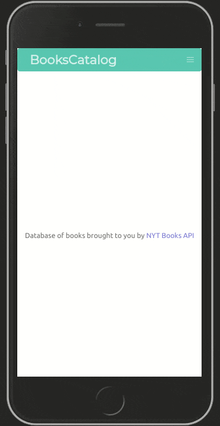

# book-catalog
>Responsive application with React & Redux getting data from NYT API

To avoid overloading the API requests are made once every 60sec.

## Live demo

<p align="center">
  <a href="https://big-react-calc.herokuapp.com">
    
  </a>
  <a href="https://big-react-calc.herokuapp.com">
    Life demo on heroku
  </a>
</p> 

## Build With

- React
- Redux
- NYT Books Api
- Cypress

## Deploy

To deploy this project localy, download or clone this repo
1. Install the required libraries (react, react-dom, redux, axios ...)
```
    npm install
```
2. Run the server locally:
```
    $ npm start
```

## Run Tests

1. Reducer tests
```
    npm run test
```
2. React tests:
```
    $ npm run cypress
```

## Author

👤 Franco Rosa

- Github: [@FrancoRosa](https://github.com/FrancoRosa)
- Linkedin: [Franco Rosa](https://www.linkedin.com/in/francoro)
- Twiteer: [@francomaker](https://twitter.com/francomaker)
## 🤝 Contributing

Contributions, issues and feature requests are welcome!
Feel free to check the [issues page](issues/).

## Show your support

Give an ⭐️ if you like this project!

<a name="acknowledgements"/>

## Acknowledgments
- [CSS-Tricks](https://css-tricks.com/using-cypress-to-write-tests-for-a-react-application/) Quickest cypress tutorial 
- [Heroku](heroku.com) to kindly host this project
- [NYT Books API](https://developer.nytimes.com/docs/books-product/1/overview) Easy to use API to get data
- [EzGif](https://ezgif.com) To build this gif quick and easy
- Team #94 Capricornus Microverse, for the morning code reviews.

## 📝 License

This project is [MIT](lic.url) licensed.